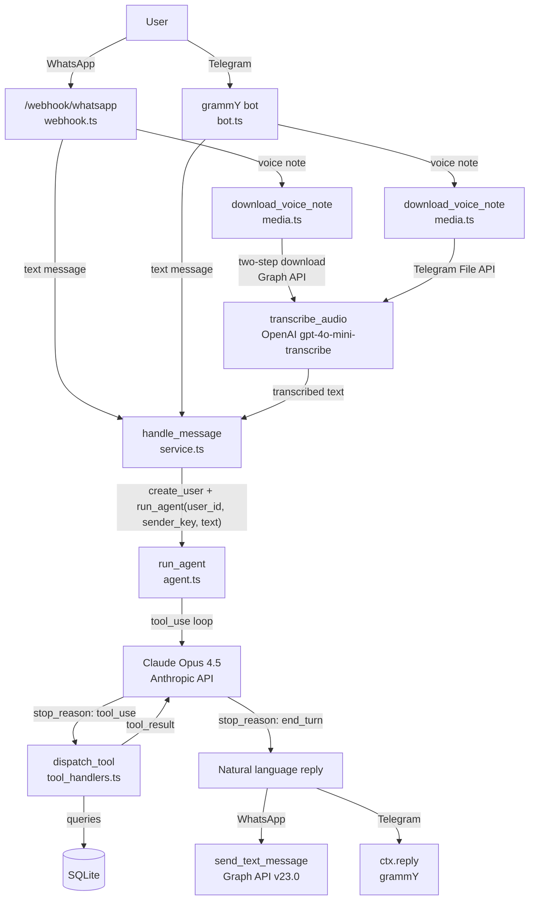
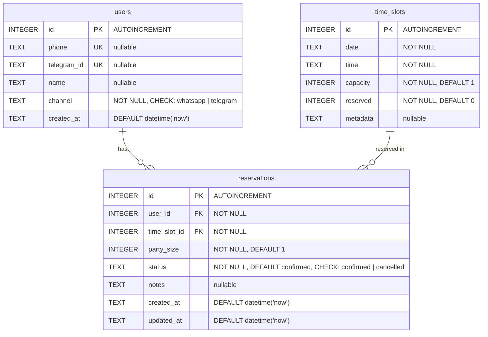
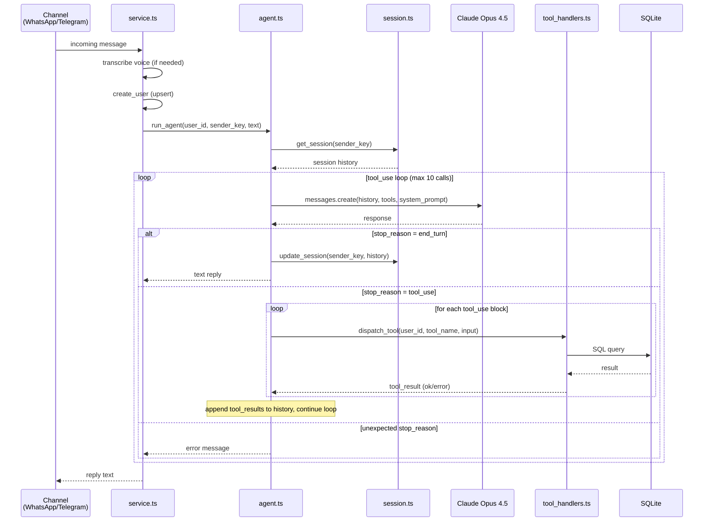

# rsvr — General Architecture

**Date:** 2026-02-03
**Status:** Phase 1 MVP — partially implemented
**Last updated:** 2026-03-08

---

## CHANGELOG

### 2026-03-18 — Dockerfile & Documentation Updates

- Updated Dockerfile in `local_infra/` to enable remote debugging
  - Runtime stage now based on `oven/bun:1.3-debian` instead of compiled binary
  - Source files included in image for `--inspect` flag support
  - ENTRYPOINT changed to `["bun"]` with CMD `["src/index.ts"]`
- Updated README.md to reflect actual tech stack (Claude Opus agent, Bun test runner)
- Added Docker/deployment section to README
- Clarified CLI argument configuration (no .env files)

### 2026-03-08 — Documentation Update

- Added this CHANGELOG section
- Replaced ASCII diagrams with Mermaid specifications
- Updated all sections to reflect actual implementation state
- Added Monitoring section (implemented but not in original doc)
- Linked [WhatsApp Cloud API Recap](./20260308_whatsapp_cloud_api_recap.md)

### 2026-03-02 — Agent Core Implementation

**Completed:**

- Agent loop (`src/agent/agent.ts`) with `claude-opus-4-5` model
- All 6 tool definitions in `src/agent/tools.ts` (Anthropic SDK `Tool[]` format)
- Tool handlers: `check_availability` — fully implemented with date/time/party_size validation
- Tool handlers: `create_reservation` — fully implemented with pre-insert capacity re-check (partial fix for Bug #5; re-check is not inside a transaction)
- Session store (`src/agent/session.ts`) — basic `Map<sender_key, session_entry>` with `get_session` / `update_session`
- System prompt (`src/agent/prompts.ts`) — runtime date injection, 7 core rules
- Agent types (`src/agent/types.ts`) — all input shapes and `tool_result_type`
- `service.ts` refactored to use `run_agent()` instead of Haiku-based intent parsing
- `config/args.ts` includes `internal_api_key` as a required field
- Agent tests (`src/agent/agent.test.ts`) and tool handler tests (`src/agent/tool_handlers.test.ts`)
- Mock infrastructure (`src/agent/mock.ts`)

**Partially implemented:**

- Tool handler `list_reservations` — works but returns `created_at` instead of appointment `date`/`time` (Bug #1 still open)

**Fully implemented:**

- Session store — TTL enforcement (30 min inactivity), history cap (40 messages)
- `create_reservation` capacity re-check — wrapped in SQLite IMMEDIATE transaction

**Not yet implemented:**

- Tool handlers: `find_reservation`, `reschedule_reservation` — return stub error strings
- Tool handler: `cancel_reservation` — fully implemented with user_id scoping
- CRUD REST API (`src/api/`) — directory does not exist
- Calendar sync stubs (`src/calendar/`) — directory does not exist
- Database indexes on `reservations` table
- `reserved >= 0` CHECK constraint on `time_slots.reserved` (present in this doc but not in `schema.sql`)

**Deviations from original plan:**

- `list_reservations` tool has no filter parameters (`from_date`, `to_date`) — the implementation accepts an empty object
- Tool input uses `reservation_id` for `find_reservation`, `cancel_reservation`, `reschedule_reservation`
- Monitoring system (`src/metrics/`) added: in-memory counters, latency histograms, Prometheus text exposition at `/metrics`, health checks at `/status` and `/health` (documented in Monitoring section below)
- Legacy parser (`src/parser/`) still exists in the codebase alongside the agent; not removed
- Anthropic SDK client is shared from `src/parser/client/anthropic.ts` (not agent-local)
- Model is `claude-opus-4-5` (specific model ID, not the generic "Claude Opus" referenced in original doc)

### 2026-02-03 — Original Document

- Initial architecture design written
- Status: decided, implementation pending

---

## Overview

rsvr is a reservation system that receives text and voice messages from WhatsApp and Telegram, processes them with a Claude Opus agent loop, and manages bookings stored in SQLite.

---

## Tech Stack

| Layer                | Choice                                           | Status      |
|----------------------|--------------------------------------------------|-------------|
| Runtime              | Bun (TypeScript, no compile step)                | Implemented |
| Web framework        | Hono                                             | Implemented |
| Database             | SQLite via `bun:sqlite` (raw SQL, no ORM)        | Implemented |
| Channels             | WhatsApp Business Cloud API, Telegram via grammY | Implemented |
| Voice transcription  | OpenAI `gpt-4o-mini-transcribe`                  | Implemented |
| Agent                | Claude Opus 4.5 (`tool_use` loop)                | Partial     |
| Monitoring           | In-memory metrics + Prometheus exposition        | Implemented |
| Linting / Formatting | Biome                                            | Implemented |
| Testing              | Bun integrated test library                      | Implemented |
| Deployment           | Dokploy (single instance)                        | Pending     |

---

## Message Flow

All intents follow the same path from channel to agent to SQLite.



The agent does NOT call the REST API over HTTP. Tool handlers call `queries.ts` in-process.

---

## Storage

SQLite is the source of truth for all bookings. No external calendar is required at MVP.

### Schema

The schema lives in `src/db/schema.sql`. The database is initialized in `src/db/client.ts` with `PRAGMA journal_mode = WAL` and `PRAGMA foreign_keys = ON`.



**Constraints:**

- `time_slots` has a UNIQUE constraint on `(date, time)`
- `reservations.user_id` references `users(id)` (foreign key)
- `reservations.time_slot_id` references `time_slots(id)` (foreign key)

### Missing from schema (documented but not yet applied)

The following items are specified in this architecture document but are NOT present in the actual `schema.sql`:

1. **`CHECK (reserved >= 0)`** on `time_slots.reserved` — prevents decrement bugs from driving the counter negative
2. **Indexes** for query performance:

```sql
CREATE INDEX IF NOT EXISTS idx_reservations_user_id
  ON reservations(user_id);

CREATE INDEX IF NOT EXISTS idx_reservations_user_id_status
  ON reservations(user_id, status);
```

Without these indexes, every per-user query performs a full table scan on `reservations`.

---

## Agent Design

### Entry point

`src/agent/agent.ts` exports:

```ts
export const run_agent = async (
  user_id: number,
  current_time_ms: number,
  sender_key: string,
  text: string,
): Promise<string>
```

`sender_key` is the session key, formatted as `channel:sender_id` (e.g., `whatsapp:+391234567890`, `telegram:12345`).

### Agent loop sequence



The loop flow implemented in `agent.ts`:

1. Append user message to session history.
2. Call Claude Opus 4.5 with tools and session history.
3. If `stop_reason === "tool_use"`: execute each tool block via `dispatch_tool`, append results, loop.
4. If `stop_reason === "end_turn"`: return the assistant text content, update session.
5. Hard cap: abort after 10 tool calls per `run_agent()` invocation (not per session) to prevent infinite loops.

### Tool definitions — `src/agent/tools.ts`

Six tools exported as `AGENT_TOOLS: Tool[]` (Anthropic SDK format):

| Tool                 | Parameters                                          | Status          | Purpose                                         |
|----------------------|-----------------------------------------------------|-----------------|--------------------------------------------------|
| `check_availability` | `date`, `time`, `party_size?`                       | Implemented     | Check slot, return `slot_id` or error            |
| `create_reservation`     | `slot_id`, `party_size?`, `notes?`              | Implemented     | Create reservation after confirmed availability  |
| `list_reservations`      | _(none)_                                        | Partial         | List caller's active reservations (missing date/time)   |
| `find_reservation`       | `reservation_id`                                | Stub            | Find a single reservation's full details         |
| `cancel_reservation`     | `reservation_id`                                | Implemented     | Cancel a reservation (user-scoped)               |
| `reschedule_reservation` | `reservation_id`, `new_date`, `new_time`        | Stub            | Move to a new slot (atomic transaction)          |

**Deviation from plan:** The original design specified `list_reservations` with optional `from_date`, `to_date` filters and used `reservation_id` for get/cancel/reschedule. The implementation uses no filters for `list_reservations` and uses `reservation_id` for the other tools.

Notes on specific tools:

- `create_reservation`: The handler re-verifies slot capacity before creating the reservation. The entire operation (check + insert + update slot) is wrapped in a SQLite IMMEDIATE transaction. See Bug #5 for resolution details.

- `cancel_reservation`: Now fully implemented with user_id scoping. Calls `queries.cancel_reservation(user_id, reservation_id)` with proper error handling.

- `find_reservation`: Not yet implemented. When implemented, must include `AND user_id = ?` in the query to prevent reading other users' reservations. The agent may hallucinate a `reservation_id`; ownership must always be verified in SQL.

- `reschedule_reservation`: Not yet implemented. When implemented, after the `UPDATE` on `reservations`, check the affected row count. If 0, the reservation does not belong to the caller — ROLLBACK the transaction and return an error string.

### Tool handlers — `src/agent/tool_handlers.ts`

Each handler:
- Accepts the tool input block from the Opus response.
- Scopes every DB read and write to the caller's `user_id`.
- Calls `db/queries.ts` directly (no HTTP).
- Returns a `tool_result_type` (discriminated union: `{ ok: true, data }` or `{ ok: false, error }`).

**Implementation status:**

| Handler                      | Status      | Notes                                                         |
|------------------------------|-------------|---------------------------------------------------------------|
| `handle_check_availability`  | Complete    | Validates date format, time format, party_size >= 1              |
| `handle_create_reservation`  | Complete    | Re-checks capacity before insert within IMMEDIATE transaction    |
| `handle_list_reservations`   | Partial     | Returns reservations but missing `date`/`time` (Bug #1)          |
| `handle_find_reservation`    | Stub        | Returns `"find_reservation is not yet implemented."`             |
| `handle_cancel_reservation`  | Complete    | Fully implemented with user_id scoping                           |
| `handle_reschedule_reservation` | Stub     | Returns `"reschedule_reservation is not yet implemented."`       |

Security invariant: the handler must verify ownership. The agent may hallucinate a `reservation_id` belonging to a different user. Every `find_reservation` and `reschedule_reservation` call must include `AND user_id = ?` in the query. The `cancel_reservation` handler already enforces this via `cancel_reservation(user_id, reservation_id)`.

### Query file

Database queries are centralized in `src/db/queries.ts`:
- Core data access: user CRUD, `check_availability`, `create_reservation`, `cancel_reservation`, `list_reservations`, `get_slot_by_id`
- All agent tool handlers import from `../db/queries`

### Session store — `src/agent/session.ts`

In-memory `Map<sender_key, session_entry_type>` where `session_entry_type` holds:
- `history: MessageParam[]` — accumulated Anthropic message history
- `last_active: number` — epoch ms

**Implemented:**
- `get_session` (returns existing or creates fresh)
- `update_session` (overwrites with new `last_active`)
- TTL enforcement: 30 minutes of inactivity resets the session via `evict_expired()` called on every access
- History cap: 40 messages enforced in `update_session()`

No SQLite persistence. Acceptable for a single-instance Dokploy deployment.

Note: if two messages from the same sender arrive concurrently (e.g., rapid double-send), both may read the same session state before either writes back. At current expected volume this is an acceptable trade-off; a per-key mutex or serialised queue would be needed to eliminate it.

### System prompt — `src/agent/prompts.ts`

The system prompt includes:
- Today's date (injected at runtime via `new Date().toISOString().split("T")[0]`).
- Instruction to ask for missing information rather than guess.
- Instruction to always call `check_availability` before `create_reservation`.
- Instruction to convert relative dates ("tomorrow", "next Friday") to absolute dates.
- Instruction to never expose raw error messages or database IDs (except reservation IDs).
- Instruction to explain tool failures in plain language.

---

## Monitoring

The monitoring subsystem was added during implementation and was not in the original architecture design. It lives in `src/metrics/`.

### Components

| File                       | Purpose                                               |
|----------------------------|-------------------------------------------------------|
| `src/metrics/registry.ts`  | In-memory counters and latency histogram (module-level singletons) |
| `src/metrics/middleware.ts` | Hono middleware that records method, path, status, duration for every request |
| `src/metrics/routes.ts`    | Three monitoring endpoints                            |

### Endpoints

| Path       | Purpose                                                                         |
|------------|---------------------------------------------------------------------------------|
| `/status`  | Minimal liveness/readiness check (database ping). Returns 200 or 503.           |
| `/health`  | Detailed health: memory usage, uptime, request counts, latency averages.        |
| `/metrics` | Prometheus text exposition format 0.0.4. Exposes counters and latency histogram.|

### Prometheus metrics exposed

| Metric                                 | Type      | Description                      |
|----------------------------------------|-----------|----------------------------------|
| `rsvr_uptime_seconds`                  | gauge     | Process uptime                   |
| `rsvr_http_requests_total`             | counter   | Total HTTP requests              |
| `rsvr_http_errors_total`               | counter   | Total 5xx responses              |
| `rsvr_http_requests_by_status_total`   | counter   | Requests by status code          |
| `rsvr_http_requests_by_method_total`   | counter   | Requests by HTTP method          |
| `rsvr_http_request_duration_ms`        | histogram | Request latency (10 buckets)     |

Latency histogram boundaries (ms): 10, 25, 50, 100, 250, 500, 1000, 2500, 5000.

---

## Why Claude Opus (not Haiku) for the Agent Loop

The existing pipeline used Haiku for single-turn structured JSON extraction. That task is well-defined and Haiku is well-calibrated for it.

The agent loop is a different workload:
- Multi-step: invoke tool, read result, decide next tool, produce natural-language summary.
- Requires correct tool input construction on every turn.
- A wrong tool input in step 1 produces a cascading failure.

Haiku failure modes in agentic loops (documented): hallucinated tool inputs, premature `end_turn`, infinite tool call cycles. Opus has significantly lower tool_use failure rate and produces better summaries. Cost trade-off is acceptable at low-to-moderate volume (dozens of conversations per day per business).

Note: the legacy Haiku-based parser still exists at `src/parser/intent.ts` (uses `claude-haiku-4-5-20251001`). It is no longer called from `service.ts` but has not been removed from the codebase.

---

## CRUD REST API

**Status: NOT IMPLEMENTED.** The `src/api/` directory does not exist. The design below is the original plan.

A separate Hono sub-app at `src/api/reservations.ts` will expose a REST interface for external consumers (dashboards, admin tools).

| Method   | Path                | Description                                                         |
|----------|--------------------|----------------------------------------------------------------------|
| `GET`    | `/reservations`     | List reservations (filters: `from_date`, `to_date`, `status`)       |
| `GET`    | `/reservations/:id` | Single reservation                                                  |
| `POST`   | `/reservations`     | Create reservation                                                  |
| `PUT`    | `/reservations/:id` | Update / reschedule                                                 |
| `DELETE` | `/reservations/:id` | Cancel                                                              |

Authentication: static API key via `x-api-key` header. Middleware in `src/api/middleware/auth.ts` will check the key against the `INTERNAL_API_KEY` env var (already present in `config/env.ts`).

The Claude Opus agent does NOT call this HTTP API. It calls `queries.ts` in-process. The REST API is only for external consumers.

---

## Security

| Surface                                | Mechanism                                                                                  | Status      |
|----------------------------------------|--------------------------------------------------------------------------------------------|-------------|
| CRUD REST API (`/bookings/*`)          | Static `INTERNAL_API_KEY` via `x-api-key` header                                          | Not built   |
| WhatsApp webhook (`/webhook/whatsapp`) | Public, validated by WhatsApp verify token                                                 | Implemented |
| WhatsApp webhook signature             | `X-Hub-Signature-256` HMAC-SHA256 validation                                              | Not built   |
| Telegram webhook                       | grammY handles Telegram secret internally                                                  | Implemented |
| Agent tool handlers                    | Every DB query scoped by `user_id`. Never trust Opus-provided IDs without ownership check. | Partial     |
| Agent loop                             | Hard cap of 10 tool calls per `run_agent()` invocation to prevent infinite loops           | Implemented |
| Monitoring endpoints                   | `/status`, `/health`, `/metrics` are public (no auth)                                      | Implemented |

**Security gaps:**
- WhatsApp `X-Hub-Signature-256` validation is not implemented. See [WhatsApp Cloud API Recap](./20260308_whatsapp_cloud_api_recap.md) Section 8 for details.
- `cancel_reservation` in `src/db/queries.ts` lacks `user_id` scoping (Bug #3). The tool handler is a stub, so this is not currently exploitable via the agent, but the query itself is unsafe.
- Monitoring endpoints are unauthenticated. Acceptable for internal deployments; should be restricted in production if exposed publicly.

---

## Why MCP Was Rejected

Three alternatives were evaluated:

### Option A: Cal.com MCP (`@calcom/cal-mcp`)

- No availability-checking tool in the default toolset.
- The underlying `/v2/slots` endpoint has documented reliability issues (open GitHub issues as of evaluation date).
- stdio transport spawns a Node.js child process: ~1.2 s cold start per invocation.
- A 3-step agentic loop adds 3-10 seconds of latency per message.
- Haiku-class models in agentic loops produce compounding errors: hallucinated slot IDs, premature termination, documented infinite loops.

### Option B: Google Calendar MCP (community, `nspady/google-calendar-mcp`)

- Server-to-server OAuth requires a service account with domain-wide delegation, which only works on Google Workspace organisations.
- Community-maintained, no official support.

### Option C: Full agentic loop with Opus for availability browsing

- Not needed. The user message already contains a specific date and time.
- Adds ~20x cost per agentic step versus Haiku with no reliability gain.
- Cal.com API availability data is the unreliable bottleneck, not model reasoning.

**Conclusion:** Agentic MCP adds latency and unreliability for no benefit when user intent already includes a specific date/time. Two direct in-process calls (`check_availability` + `create_reservation`) are deterministic and latency-bounded.

---

## Multi-Calendar Integration: Phased Approach

### Phase 1 (MVP — current)

SQLite is the source of truth. No external calendar integration.

**Planned but not implemented:** Stub hooks in `src/calendar/sync.ts`. The `src/calendar/` directory does not yet exist. When created, the stubs should carry explicit type signatures so that Phase 2 can implement them without changing call sites:

```ts
export const sync_booking_created = async (
  reservation: reservation_row_type & { date: string; time: string },
): Promise<void> => {}

export const sync_booking_cancelled = async (
  reservation_id: number,
): Promise<void> => {}

export const sync_booking_rescheduled = async (
  old_reservation: reservation_row_type & { date: string; time: string },
  new_reservation: reservation_row_type & { date: string; time: string },
): Promise<void> => {}
```

The `date` and `time` fields come from the JOIN on `time_slots` (see Bug #1). Phase 2 receives them without needing to re-query.

### Phase 2: Cal.com as multi-calendar proxy

Use Cal.com Cloud REST API v2 directly (not via MCP):
- `GET /v2/slots` — check availability
- `POST /v2/bookings` — create reservation

Cal.com allows each client to connect their Google Calendar, Outlook, or Apple Calendar. rsvr speaks to one REST API; Cal.com handles provider dispatch.

New env vars needed: `CALCOM_API_KEY`, `CALCOM_RESTAURANT_EVENT_TYPE_ID`, `CALCOM_DOCTOR_EVENT_TYPE_ID`, `CALCOM_SALON_EVENT_TYPE_ID`.

Phase 2 is implemented by replacing the no-op stubs in `src/calendar/sync.ts`. Tool handler code does not change.

### Phase 3: Native adapters (on demand)

Only if clients refuse Cal.com:

| Provider                              | Protocol                                        | Library                             |
|---------------------------------------|-------------------------------------------------|-------------------------------------|
| Google Calendar                       | OAuth 2.0 + REST v3 (`/freeBusy`, `/events`)    | `googleapis`                        |
| Microsoft 365                         | Microsoft Graph API (`/getSchedule`, `/events`) | `@microsoft/microsoft-graph-client` |
| Apple iCloud / CalDAV                 | CalDAV (PROPFIND, PUT, iCal)                    | `tsdav`                             |
| Self-hosted CalDAV (Radicale, Baikal) | CalDAV                                          | `tsdav`                             |

Phase 3 is a significant effort: OAuth callback handlers, token storage, refresh logic, per-tenant credential encryption. Estimated 3-5 weeks. Not justified until clients with external calendars onboard.

---

## File Structure (actual state as of 2026-03-08)

```
src/
  index.ts                        # Hono app, route registration, Telegram bot start
  config/
    args.ts                       # CLI argument parsing (all 10 required args)
  db/
    schema.sql                    # SQLite schema (3 tables, no indexes)
    client.ts                     # bun:sqlite connection (WAL mode, foreign keys ON)
    queries.ts                    # Core SQL: user CRUD, availability, reservation CRUD
    queries.test.ts               # Query tests
  channels/
    types.ts                      # incoming_message_type, outgoing_message_type, channel_type
    whatsapp/
      webhook.ts                  # Hono routes: GET verification, POST handler
      client.ts                   # Graph API v23.0 client: send messages, download media
      media.ts                    # Voice note download helper
    telegram/
      bot.ts                      # grammY bot: text + voice handlers
      media.ts                    # Telegram File API voice note download
  voice/
    transcribe.ts                 # OpenAI gpt-4o-mini-transcribe
    client/
      openai.ts                   # OpenAI SDK client
  agent/
    agent.ts                      # run_agent() — Opus tool_use loop
    agent.test.ts                 # Agent tests
    tools.ts                      # AGENT_TOOLS: Tool[] (6 tools, Anthropic SDK format)
    tool_handlers.ts              # In-process tool implementations (4 complete, 2 stubs)
    tool_handlers.test.ts         # Tool handler tests
    session.ts                    # In-memory session store (Map, TTL, history cap)
    session.test.ts               # Session store tests
    prompts.ts                    # System prompt builder
    types.ts                      # session_entry_type, tool input types, tool_result_type
    mock.ts                       # Test mocks
  parser/                         # LEGACY — no longer called from service.ts
    prompts.ts                    # Intent extraction prompts
    types.ts                      # intent_type
    client/
      anthropic.ts                # Shared Anthropic SDK client (also used by agent)
      mock.ts                     # Parser test mocks
  reservations/
    service.ts                    # handle_message: voice routing + run_agent()
    service.test.ts               # Service tests
    types.ts                      # Reservation types
    mock.ts                       # Service test mocks
  metrics/                        # Monitoring (added during implementation, see Monitoring section)
    registry.ts                   # In-memory counters + latency histogram
    middleware.ts                 # Hono middleware: records request metrics
    routes.ts                     # /status, /health, /metrics endpoints
  middleware/
    internal_auth.ts              # Internal API key middleware
    internal_auth.test.ts         # Auth middleware tests
    debug_request_logger.ts       # Debug logging for requests
  shared/
    logger.ts                     # Structured JSON logger (info/warn/error/debug)
```

**Not yet created:**

```
  api/                            # PLANNED — CRUD REST API
    bookings.ts                   # Hono sub-app
    middleware/
      auth.ts                     # x-api-key middleware
  calendar/                       # PLANNED — sync stubs for Phase 2/3
    sync.ts                       # No-op sync hooks
    adapters/
      google.ts                   # Phase 3
      m365.ts                     # Phase 3
```

---

## Known Bugs

These defects exist in the current codebase. Status updated as of 2026-03-08.

### Bug #1 — `list_reservations`: missing JOIN on `time_slots`

**Status: OPEN**

`db/queries.ts`: the query selects from `reservations` only. The returned `reservation_row_type` has no `date` or `time` fields. The agent's `list_reservations` handler returns `created_at` but cannot return the actual appointment date/time.

Fix: add a JOIN on `time_slots` and return `time_slots.date` and `time_slots.time` in the result set.

### Bug #2 — `service.ts`: wrong date in reservation list

**Status: RESOLVED (indirectly)**

`service.ts` no longer formats reservation lists directly. It delegates to `run_agent()`, which calls `handle_list_reservations`. However, `handle_list_reservations` still only returns `created_at` (see Bug #1), so the underlying data issue persists — it has moved from the service layer to the tool handler layer.

### Bug #3 — `cancel_reservation`: `user_id` scoping

**Status: RESOLVED**

`db/queries.ts:153` now includes `user_id` scoping: `cancel_reservation(user_id: number, reservation_id: number)` performs both SELECT and UPDATE with `AND user_id = ?` in the WHERE clause. The `cancel_reservation` tool handler is fully implemented and calls this function correctly.

### Bug #4 — No `reschedule_reservation` query

**Status: OPEN**

No reschedule logic exists in `db/queries.ts`. The `reschedule_reservation` tool handler is a stub. When implemented, it must be a SQLite transaction:

```sql
BEGIN;
  UPDATE time_slots SET reserved = reserved - party_size WHERE id = old_slot_id;
  UPDATE time_slots SET reserved = reserved + party_size WHERE id = new_slot_id;
  UPDATE reservations
    SET time_slot_id = new_slot_id, updated_at = datetime('now')
    WHERE id = reservation_id AND user_id = ?;
COMMIT;
```

If any step fails or the `UPDATE reservations` affects 0 rows (wrong user), roll back the entire transaction.

### Bug #5 — `create_reservation`: no transactional capacity re-check

**Status: PARTIALLY ADDRESSED**

The `handle_create_reservation` handler in `tool_handlers.ts` re-verifies slot capacity by calling `get_slot_by_id` and checking `remaining < party_size` before calling `create_reservation`. However, the re-check and the insert are NOT inside a single SQLite transaction. A concurrent request could theoretically fill the slot between the check and the insert.

The `create_reservation` function in `db/queries.ts` performs the INSERT and UPDATE as two separate statements, also not in a transaction.

Fix: wrap the capacity re-check, INSERT, and UPDATE in a single `BEGIN`/`COMMIT` block.

### Bug #6 — `service.ts`: `cancel_reservation` called without `user_id` scoping

**Status: RESOLVED**

`service.ts` has been refactored to use `run_agent()`. It no longer calls `cancel_reservation` directly. The unscoped cancel function still exists in `db/queries.ts` (see Bug #3) but is not called from the current code path.

---

## Environment Variables

| Variable                          | Phase | Purpose                                                       | Required |
|-----------------------------------|-------|---------------------------------------------------------------|----------|
| `PORT`                            | 1     | Server port (default: 3000)                                   | No       |
| `TELEGRAM_BOT_TOKEN`              | 1     | grammY bot token                                              | Yes      |
| `WHATSAPP_VERIFY_TOKEN`           | 1     | Webhook verification token                                    | Yes      |
| `WHATSAPP_APP_SECRET`             | 1     | Webhook signature validation (HMAC-SHA256)                    | Yes      |
| `WHATSAPP_ACCESS_TOKEN`           | 1     | Cloud API access token                                        | Yes      |
| `WHATSAPP_PHONE_NUMBER_ID`        | 1     | Cloud API sender phone number ID                              | Yes      |
| `ANTHROPIC_API_KEY`               | 1     | Claude Opus agent                                             | Yes      |
| `OPENAI_API_KEY`                  | 1     | Voice transcription (gpt-4o-mini-transcribe)                  | Yes      |
| `INTERNAL_API_KEY`                | 1     | CRUD REST API static key (x-api-key header)                   | Yes      |
| `DATABASE_PATH`                   | 1     | SQLite file path (default: `./data/rsvr.db`)                  | No       |
| `CALCOM_API_KEY`                  | 2     | Cal.com REST v2 (Phase 2)                                     | No       |
| `CALCOM_EVENT_TYPE_ID`            | 2     | Cal.com event type ID (Phase 2)                               | No       |

All variables are passed via CLI arguments at startup, not via `.env` files. Example: `bun run src/index.ts --port 3000 --telegram_bot_token xxx --anthropic_api_key xxx ...`. There is no environment variable fallback support.

---

## Related Documents

| Document                                                                 | Description                                                                |
|--------------------------------------------------------------------------|----------------------------------------------------------------------------|
| [WhatsApp Cloud API Recap](./20260308_whatsapp_cloud_api_recap.md)       | Detailed mapping between official WhatsApp API docs and rsvr implementation, including all identified gaps |
