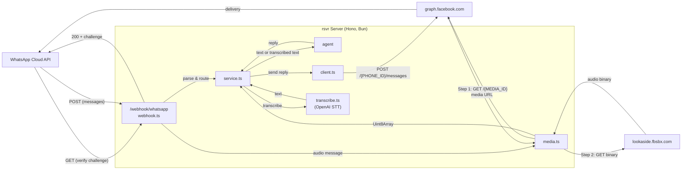
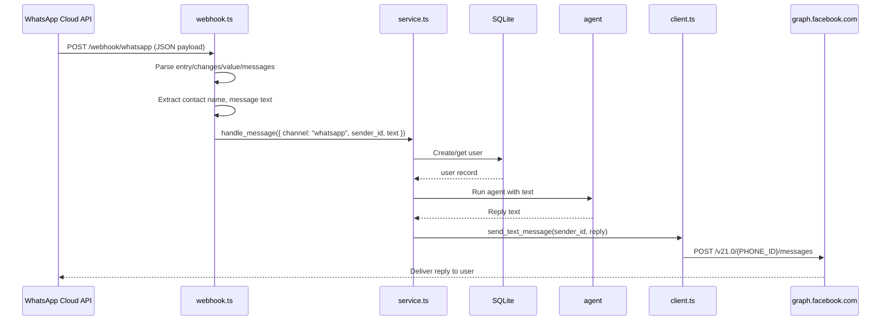
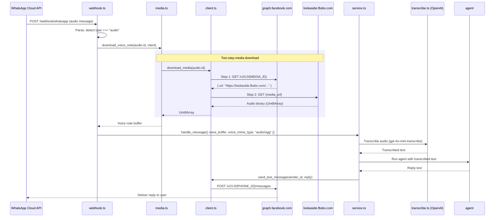

# WhatsApp Business Cloud API -- Implementation Recap

> Generated: 2026-03-08
> Scope: Mapping between the official WhatsApp Business Cloud API documentation and the rsvr codebase implementation.

---

## Table of Contents

1. [Architecture Overview](#1-architecture-overview)
2. [Configuration and Authentication](#2-configuration-and-authentication)
3. [Webhook Verification (GET)](#3-webhook-verification-get)
4. [Webhook Message Reception (POST)](#4-webhook-message-reception-post)
5. [Sending Messages](#5-sending-messages)
6. [Media Download (Voice Notes)](#6-media-download-voice-notes)
7. [End-to-End Message Flow](#7-end-to-end-message-flow)
8. [Gaps and Deviations](#8-gaps-and-deviations)
9. [Official Documentation Links](#9-official-documentation-links)

---

## 1. Architecture Overview



**Files involved:**

| File                                     | Role                                          |
|------------------------------------------|-----------------------------------------------|
| `src/channels/whatsapp/webhook.ts`       | Hono routes: GET verification, POST handler   |
| `src/channels/whatsapp/client.ts`        | Graph API client: send messages, get media    |
| `src/channels/whatsapp/media.ts`         | Voice note download helper                    |
| `src/channels/types.ts`                 | Shared `incoming_message_type` interface       |
| `src/config/args.ts`                    | CLI argument parsing and config validation     |
| `src/reservations/service.ts`            | Message orchestrator (text/voice routing)      |
| `src/voice/transcribe.ts`               | OpenAI audio transcription                     |

---

## 2. Configuration and Authentication

### Official API Requirements

The WhatsApp Cloud API requires:
- **Access Token**: A permanent System User token or a temporary token from the Meta App Dashboard. Passed as `Authorization: Bearer <TOKEN>` on every Graph API request.
- **Phone Number ID**: Identifies which WhatsApp business phone number to send from. Used in the URL path: `/{PHONE_NUMBER_ID}/messages`.
- **Verify Token**: An arbitrary string you define, used during webhook registration to prove endpoint ownership.
- **App Secret**: Used to validate `X-Hub-Signature-256` on incoming webhook POSTs (HMAC-SHA256 of the payload body).

### Current Implementation

**File:** `src/config/args.ts`

| Config Key                 | CLI Argument                 | Required | Usage                                                            |
|----------------------------|------------------------------|----------|------------------------------------------------------------------|
| `whatsapp_verify_token`    | `--whatsapp_verify_token`    | Yes      | Webhook GET verification                                         |
| `whatsapp_access_token`    | `--whatsapp_access_token`    | Yes      | Bearer token for all Graph API calls                             |
| `whatsapp_phone_number_id` | `--whatsapp_phone_number_id` | Yes      | URL path segment for send/media APIs                             |
| `whatsapp_app_secret`      | `--whatsapp_app_secret`      | Yes      | HMAC-SHA256 secret for webhook signature validation              |
| `graph_api_base`           | `--graph_api_base`           | No       | Graph API base URL (default: `https://graph.facebook.com/v23.0`) |

All are passed as CLI arguments at startup. Missing required values cause a hard error. Example:
```bash
bun run src/index.ts \
  --whatsapp_verify_token abc123 \
  --whatsapp_access_token xyz789 \
  --whatsapp_phone_number_id 1234567890 \
  --whatsapp_app_secret secret999
```

---

## 3. Webhook Verification (GET)

### Official Spec

When you register a webhook URL in the Meta App Dashboard, Meta sends a GET request with three query parameters:

| Parameter           | Description                                    |
|---------------------|------------------------------------------------|
| `hub.mode`          | Always `"subscribe"`                           |
| `hub.verify_token`  | The string you configured in the App Dashboard |
| `hub.challenge`     | An integer you must echo back as the response  |

**Expected behavior:**
1. Verify `hub.mode === "subscribe"`
2. Verify `hub.verify_token` matches your configured token
3. Respond with HTTP 200 and the `hub.challenge` value as the response body (plain text)
4. If verification fails, respond with a non-200 status

### Current Implementation

**File:** `src/channels/whatsapp/webhook.ts`

```
GET /webhook/whatsapp
```

The verification handler does:
1. Checks `mode === "subscribe"` -- **matches spec**
2. Checks `token === configs.whatsapp_verify_token` using `timingSafeEqual` for constant-time comparison -- **exceeds spec** (timing-safe prevents token prediction attacks)
3. Returns `c.text(challenge ?? "", 200)` on success -- **matches spec** (plain text, HTTP 200)
4. Returns `c.text("Forbidden", 403)` on failure -- **matches spec** (non-200)

**Alignment: FULL.** The verification implementation correctly follows the official specification and adds timing-safe comparison for enhanced security.

---

## 4. Webhook Message Reception (POST)

### Official Spec -- Payload Structure

Meta sends POST requests to the webhook URL with this JSON structure:

```json
{
  "object": "whatsapp_business_account",
  "entry": [
    {
      "id": "WHATSAPP_BUSINESS_ACCOUNT_ID",
      "changes": [
        {
          "value": {
            "messaging_product": "whatsapp",
            "metadata": {
              "display_phone_number": "16505551111",
              "phone_number_id": "123456789"
            },
            "contacts": [
              {
                "profile": { "name": "Sender Name" },
                "wa_id": "16315551181"
              }
            ],
            "messages": [
              {
                "from": "16315551181",
                "id": "wamid.ABGGFlA5Fpa",
                "timestamp": "1504902988",
                "type": "text",
                "text": { "body": "Hello!" }
              }
            ]
          },
          "field": "messages"
        }
      ]
    }
  ]
}
```

For audio/voice messages, the `messages` array contains:

```json
{
  "from": "16315551181",
  "id": "wamid.HBg...",
  "timestamp": "1754849070",
  "type": "audio",
  "audio": {
    "mime_type": "audio/ogg; codecs=opus",
    "sha256": "AxdsE50BYZP5xkoQ2osP3eLq3oejVjNLlu+Kd30NVC8=",
    "id": "2914625362044713",
    "voice": true
  }
}
```

**Official requirements for the POST handler:**
- Respond with HTTP 200 quickly (within a few seconds)
- Process messages asynchronously if needed
- Handle batched entries (multiple entries/changes/messages)
- Validate `X-Hub-Signature-256` header using the app secret
- Be idempotent (Meta retries failed deliveries for up to 7 days)

### Current Implementation

**File:** `src/channels/whatsapp/webhook.ts`

**Security Features:**
- **Body size validation**: Validates `Content-Length` header exists and is ≤ 5MB. Verifies actual body size matches header.
- **HMAC-SHA256 signature validation**: Validates `X-Hub-Signature-256` header using `whatsapp_app_secret`. Uses `Bun.CryptoHasher("sha256", secret)` with hex format validation and `timingSafeEqual` for constant-time comparison. Rejects request with HTTP 403 if signature is invalid or missing.
- **JSON parsing error handling**: Returns HTTP 400 for unparseable JSON.
- **Rate limiting**: Enforces 60 messages per sender per minute. Uses in-memory Map with LRU eviction at 10,000 entries.

**Type definitions:**

```typescript
type whatsapp_webhook_entry_type = {
  changes: {
    value: {
      messages?: whatsapp_message_type[]
      contacts?: whatsapp_contact_type[]
    }
  }[]
}

type whatsapp_message_type = {
  from: string
  type: string
  text?: { body: string }
  audio?: { id: string; mime_type: string }
}

type whatsapp_contact_type = { profile: { name: string } }
```

**POST handler:**
1. Validates webhook body size (≤ 5MB, Content-Length header)
2. Validates `X-Hub-Signature-256` header (returns 403 if invalid/missing)
3. Parses JSON body (returns 400 if unparseable)
4. Parses `body.entry` as the entries array
5. If no entries, returns `{ status: "ok" }` immediately
6. Flattens `entries -> changes -> value`, filtering for those with `messages`
7. Extracts contact name from the first value's contacts array
8. Flattens all messages across values
9. Checks rate limit (returns 429 if exceeded)
10. Calls `whatsapp_messages_handler` in a try/catch
11. Always returns `{ status: "ok" }` (HTTP 200) after basic validation

**Message handler:**
- Iterates messages sequentially using `for...of` loop with proper `await` handling
- For `type === "text"`: extracts `msg.text.body`
- For `type === "audio"`: downloads voice note via `download_voice_note`
- Calls `handle_message` (reservation service) and sends the reply
- Errors in individual message processing are caught and logged

### Alignment Analysis

| Aspect                           | Official Spec                                       | Implementation                                      | Status    |
|----------------------------------|-----------------------------------------------------|-----------------------------------------------------|-----------|
| Respond with HTTP 200            | Must return 200 quickly                             | Always returns `{ status: "ok" }` (200)             | ALIGNED   |
| Parse entry/changes/value        | Nested structure with arrays                        | Correctly flattened                                 | ALIGNED   |
| Text message extraction          | `messages[].text.body`                              | `msg.text.body`                                     | ALIGNED   |
| Audio message extraction         | `messages[].audio.id` + `audio.mime_type`           | `msg.audio.id` used                                 | ALIGNED   |
| Contact name extraction          | `contacts[].profile.name`                           | `contacts?.[0]?.profile.name`                       | ALIGNED   |
| `X-Hub-Signature-256` validation | HMAC-SHA256 with app secret                         | **IMPLEMENTED** with timingSafeEqual                | ALIGNED   |
| Body size validation             | Should validate request size                        | **IMPLEMENTED** (5MB max, Content-Length check)      | ALIGNED   |
| Rate limiting                    | Recommendation for DoS protection                   | **IMPLEMENTED** (60 msgs/sender/min, LRU)           | EXCEEDS   |
| `metadata` field                 | Contains `phone_number_id`, `display_phone_number`  | **Not typed or used**                               | GAP       |
| `object` field check             | Should be `"whatsapp_business_account"`             | **Not checked**                                     | GAP       |
| Message `id` field               | Unique message ID (for idempotency)                 | **Not extracted or used**                           | GAP       |
| Message `timestamp` field        | Unix timestamp of message                           | **Not extracted or used**                           | GAP       |
| Audio `sha256` field             | Hash for integrity verification                     | **Not used**                                        | GAP       |
| Audio `voice` boolean            | Distinguishes voice notes from audio files          | **Not checked**                                     | MINOR GAP |
| Status notifications             | Sent/delivered/read status updates                  | **Not handled** (filtered out by messages check)    | GAP       |
| Async processing                 | Process asynchronously, respond fast                | Uses `for...of` with proper `await`                 | ALIGNED   |

---

## 5. Sending Messages

### Official Spec

**Endpoint:**
```
POST https://graph.facebook.com/v{API_VERSION}/{PHONE_NUMBER_ID}/messages
```

**Headers:**
```
Authorization: Bearer {ACCESS_TOKEN}
Content-Type: application/json
```

**Request body (text message):**
```json
{
  "messaging_product": "whatsapp",
  "recipient_type": "individual",
  "to": "PHONE_NUMBER",
  "type": "text",
  "text": {
    "preview_url": false,
    "body": "Message content"
  }
}
```

**Success response:**
```json
{
  "messaging_product": "whatsapp",
  "contacts": [{ "input": "16505555555", "wa_id": "16505555555" }],
  "messages": [{ "id": "wamid.HBgLMTY1MDUwNzY1MjA..." }]
}
```

Note: A successful API response only means Meta accepted the request. It does not confirm delivery. Delivery status arrives via webhook status notifications.

### Current Implementation

**File:** `src/channels/whatsapp/client.ts`

**Architecture:** Uses factory pattern. `create_whatsapp_client(graph_api_base, whatsapp_access_token, whatsapp_phone_number_id)` returns a `whatsapp_client_type` object with `send_text_message` and `download_media` methods as closures.

**API version:** Configurable via `--graph_api_base` CLI arg, defaults to `https://graph.facebook.com/v23.0` (previously hardcoded to `v21.0`).

**`send_text_message` function:**
```typescript
const url = `${graph_api_base}/${whatsapp_phone_number_id}/messages`
// POST with:
{
  messaging_product: "whatsapp",
  to,
  type: "text",
  text: { body: text },
}
```

On HTTP error: logs error message AND throws `new Error()` (robust error propagation).

### Alignment Analysis

| Aspect             | Official Spec                             | Implementation                                           | Status  |
|--------------------|-------------------------------------------|----------------------------------------------------------|---------|
| Endpoint URL       | `graph.facebook.com/v{VER}/{ID}/messages` | `graph.facebook.com/v23.0/{ID}/messages` (configurable)  | ALIGNED |
| Auth header        | `Bearer {TOKEN}`                          | `Bearer ${whatsapp_access_token}`                        | ALIGNED |
| Content-Type       | `application/json`                        | Set explicitly                                           | ALIGNED |
| `messaging_product`| Required, must be `"whatsapp"`            | Included                                                 | ALIGNED |
| `recipient_type`   | Optional, defaults to `"individual"`      | **Not included** (acceptable, uses default)              | OK      |
| `to` field         | Recipient phone number                    | Included                                                 | ALIGNED |
| `type` field       | Message type identifier                   | `"text"`                                                 | ALIGNED |
| `text.body`        | Message text content                      | Included                                                 | ALIGNED |
| `text.preview_url` | Optional, enables link previews           | **Not included** (defaults to false)                     | OK      |
| Error handling     | Check HTTP status, parse error JSON       | Checks `response.ok`, logs error, throws                 | ALIGNED |
| Response parsing   | Contains message ID for tracking          | **Response body not parsed or used**                     | GAP     |

---

## 6. Media Download (Voice Notes)

### Official Spec -- Two-Step Process

**Step 1: Retrieve media metadata**
```
GET https://graph.facebook.com/v{API_VERSION}/{MEDIA_ID}
Authorization: Bearer {ACCESS_TOKEN}
```

Response:
```json
{
  "url": "https://lookaside.fbsbx.com/...",
  "mime_type": "audio/ogg; codecs=opus",
  "sha256": "...",
  "file_size": 12345,
  "id": "MEDIA_ID"
}
```

The `url` field expires after approximately 5 minutes.

**Step 2: Download binary**
```
GET {url from step 1}
Authorization: Bearer {ACCESS_TOKEN}
```

Returns raw binary data of the media file.

### Current Implementation

**File:** `src/channels/whatsapp/client.ts`

**`download_media` function:**
1. Step 1: `GET ${graph_api_base}/${media_id}` with Bearer token -- **matches spec**
2. Parses response as `{ url: string }` -- **matches spec** (only extracts `url`, ignores `mime_type`, `sha256`, `file_size`)
3. Step 2: `GET {url}` with Bearer token -- **matches spec**
4. Returns `Uint8Array` of the binary -- **matches spec**

**File:** `src/channels/whatsapp/media.ts`

**`download_voice_note` function:**
- Takes `(media_id: string, client: whatsapp_client_type)` as dependency-injected parameters (improves testability)
- Wraps `download_media(media_id, client)` and hardcodes the MIME type to `"audio/ogg"`

### Alignment Analysis

| Aspect                      | Official Spec                              | Implementation                          | Status  |
|-----------------------------|--------------------------------------------|-----------------------------------------|---------|
| Step 1: GET media metadata  | `GET /v{VER}/{MEDIA_ID}` with Bearer token | Correct (line 39)                       | ALIGNED |
| Step 1: Parse URL from JSON | Response has `url` field                   | Parsed as `{ url: string }` (line 48)   | ALIGNED |
| Step 2: GET binary from URL | `GET {url}` with Bearer token              | Correct (lines 49-51)                   | ALIGNED |
| Step 2: Return binary       | Raw binary response                        | Returns `Uint8Array` (line 57)          | ALIGNED |
| MIME type from metadata     | Available in step 1 response `mime_type`   | **Ignored; hardcoded to `"audio/ogg"`** | GAP     |
| `sha256` integrity check    | Available for verification                 | **Not used**                            | GAP     |
| URL expiry handling         | URL expires in ~5 minutes                  | Downloaded immediately (no caching)     | OK      |

---

## 7. End-to-End Message Flow

### Incoming Text Message



### Incoming Voice Note



---

## 8. Gaps and Deviations

### CRITICAL -- Security

| #  | Gap                                  | Risk                                                          | Status       | Recommendation                                                                                       |
|----|--------------------------------------|---------------------------------------------------------------|--------------|------------------------------------------------------------------------------------------------------|
| 1  | **`X-Hub-Signature-256` validation** | Spoofing: any party can POST to `/webhook/whatsapp`           | **RESOLVED** | Uses `WHATSAPP_APP_SECRET` CLI arg. HMAC-SHA256 + timingSafeEqual. Rejects with 403.                 |
| 2  | **No `object` field check**          | Malformed or unrelated payloads processed without validation  | OPEN         | Check `body.object === "whatsapp_business_account"` before processing entries.                       |

### MODERATE -- Robustness

| #  | Gap                                               | Impact                                                     | Recommendation                                                                    |
|----|---------------------------------------------------|------------------------------------------------------------|-------------------------------------------------------------------------------------|
| 3  | **`forEach` with async callback** (webhook.ts:77) | Unhandled promise rejections; async errors silently lost   | Use `Promise.all(messages.map(...))` or fire-and-forget with `.catch()` per message |
| 4  | **No message deduplication**                      | Meta retries up to 7 days; duplicates produce double replies | Track processed `message.id` in SQLite or in-memory set with TTL                  |
| 5  | **Status notifications not handled**              | Sent/delivered/read status webhooks silently ignored       | Add branch for `statuses` in value object; at minimum log them                     |
| 6  | **Send response not parsed**                      | Cannot track outbound message IDs for delivery confirmation | Parse send response to extract `messages[0].id`; store for status correlation      |

### MINOR -- Data Fidelity

| #  | Gap                                      | Impact                                                              | Recommendation                                                                      |
|----|------------------------------------------|---------------------------------------------------------------------|--------------------------------------------------------------------------------------|
| 9  | **MIME type hardcoded to `"audio/ogg"`** | Different formats (e.g., `audio/mpeg`) would fail transcription     | Use `mime_type` from webhook payload or step-1 media metadata instead of hardcoding  |
| 10 | **Audio `sha256` not verified**          | Downloaded media integrity is not confirmed                         | Compare SHA256 of downloaded buffer against `audio.sha256` from webhook payload      |
| 11 | **`timestamp` and `id` not extracted**   | No audit trail of message timing or unique identifiers              | Add `id` and `timestamp` to `whatsapp_message_type` and `incoming_message_type`      |
| 12 | **`metadata` not typed**                 | `phone_number_id` / `display_phone_number` unavailable for multi-num | Add `metadata` to `whatsapp_webhook_entry_type` for multi-number routing             |
| 13 | **`audio.voice` not checked**            | Cannot distinguish voice notes from audio file attachments          | Check `audio.voice === true` if different handling is desired                         |
| 14 | **API version configurable**             | Was hardcoded `v21.0`; would go stale as Meta deprecates versions   | **RESOLVED** -- Configurable via `--graph_api_base` CLI arg, defaults to `v23.0`     |

---

## 9. Official Documentation Links

| Topic                         | URL                                                                                                          |
|-------------------------------|--------------------------------------------------------------------------------------------------------------|
| Cloud API Overview            | https://developers.facebook.com/docs/whatsapp/cloud-api/get-started                                         |
| Webhook Setup                 | https://developers.facebook.com/docs/whatsapp/cloud-api/guides/set-up-webhooks                              |
| Webhook Components (payloads) | https://developers.facebook.com/docs/whatsapp/cloud-api/webhooks/components                                 |
| Messages Reference (send)     | https://developers.facebook.com/docs/whatsapp/cloud-api/reference/messages                                  |
| Media Reference (download)    | https://developers.facebook.com/docs/whatsapp/cloud-api/reference/media                                     |
| Send Text Messages Guide      | https://developers.facebook.com/docs/whatsapp/cloud-api/guides/send-messages                                |
| Graph API Webhooks (general)  | https://developers.facebook.com/docs/graph-api/webhooks/getting-started                                     |
| Audio Messages Webhook Ref    | https://developers.facebook.com/documentation/business-messaging/whatsapp/webhooks/reference/messages/audio  |
| Webhook Signature Validation  | https://developers.facebook.com/docs/graph-api/webhooks/getting-started#verification-requests               |
